# International-Debt-Analysis-using-SQL
This project explores international debt trends using data from the World Bank, covering developing countries from 1970 to 2015. The dataset provides insights into total debt, different debt categories, and financial trends across multiple nations.

Using SQL, this project aims to answer key financial questions, including:
1. The total amount of debt owed by all countries in the dataset
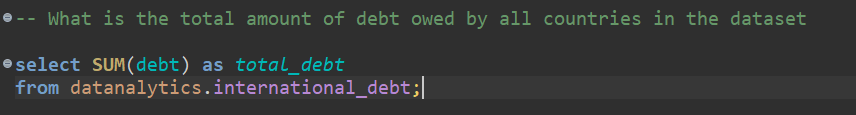

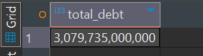

2. The distinct countries recorded in the dataset
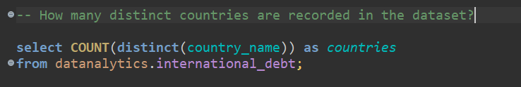
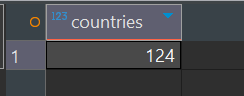

3. The distinct types of debt indicators and what they represent
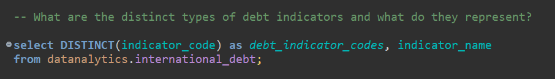
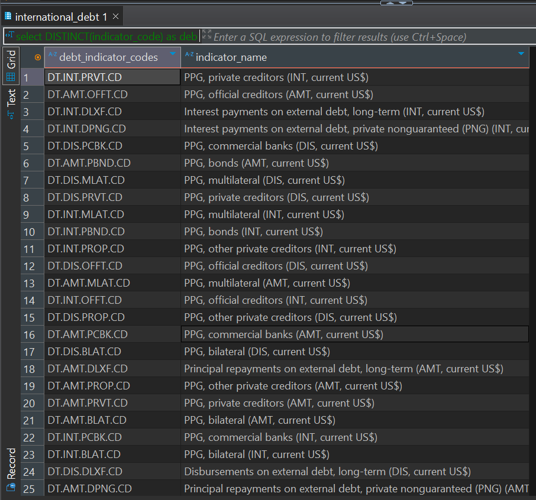
4. Country with the highest total debt and how much it owes
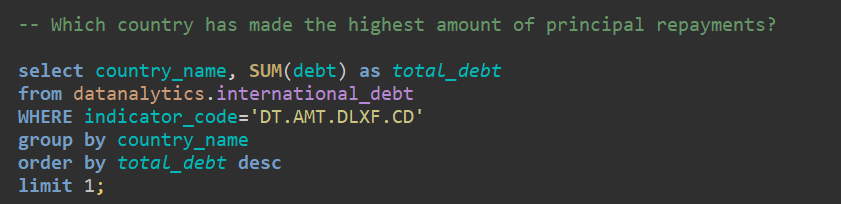
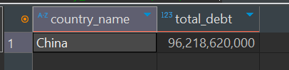
5. The average debt across different debt indicators
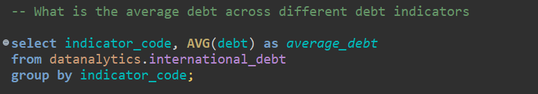
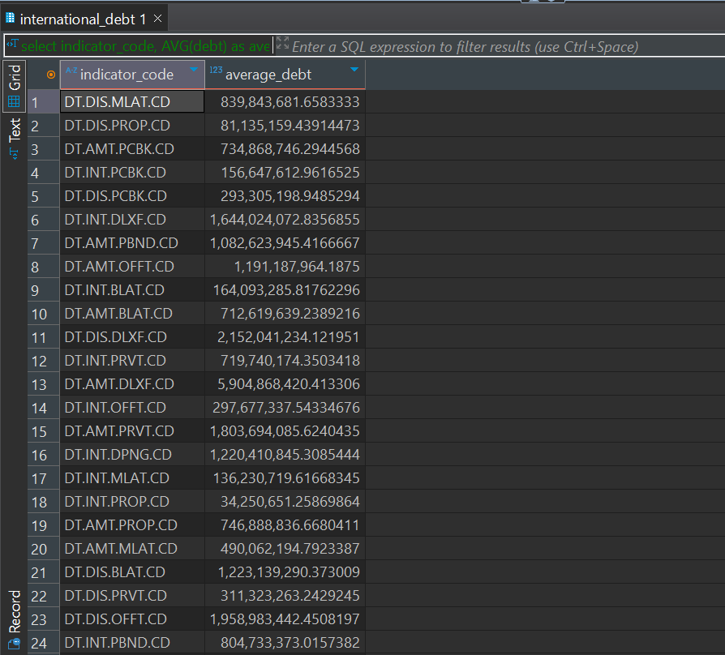
6. The country with the highest amount of principal repayments
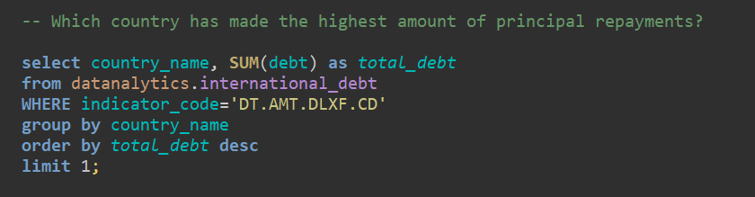
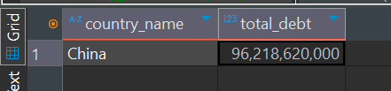
7. The most common debt indicators across all countries
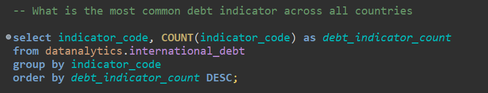
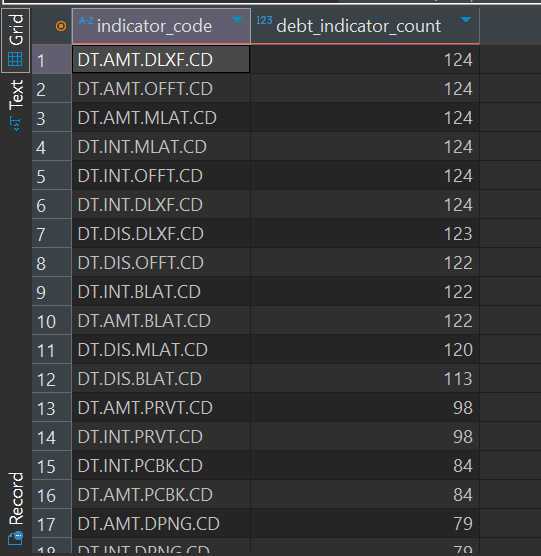

